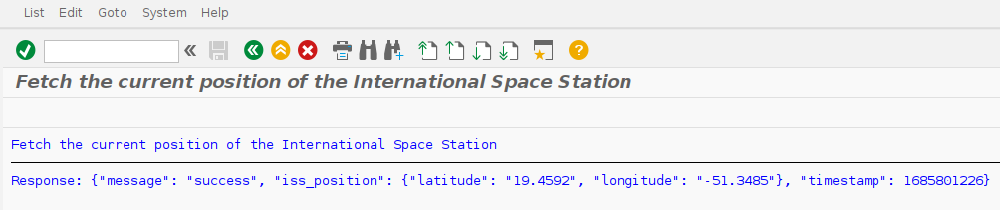

# SAP-ISS 👨‍🚀
ABAP script that fetches the current position of the International Space Station.

My inital plan to call OpenAI's API failed, because I couldn't get SSL-certificates working in my SAP installation.

This API is reachable without HTTPS.
